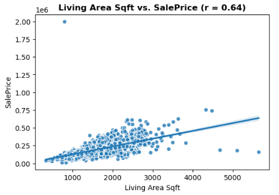
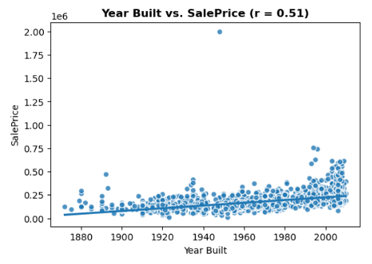
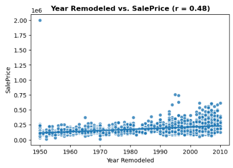

# Prediction-of-Houses-Sales
## Project Overview
As part of my data science bootcamp, this project aims to support a group of homeowners in Ames, Iowa, who are concerned about the declining value of their properties. The goal is to analyze raw housing market data to uncover actionable insights and deliver data-driven recommendations for increasing home value prior to sale.

## Objectives
- Explore and clean the Ames housing dataset
- Identify key features that influence property value
- Build predictive models to estimate home prices
- Deliver practical suggestions for value-boosting renovations or improvements

##  Exploratory Visuals & Insights

### 1. Distribution of Sale Price
  
- Sale prices are **right-skewed**, with most houses selling between \$100K–\$250K.  

---

### 2. Correlation Heatmap
  
- Features such as **Overall Quality, Living Area, and Garage Cars** show strong positive correlations with SalePrice.  
- Suggests buyers value **quality, size, and garage capacity** most.  
- Heatmaps only capture **linear** relationships. For non-linear effects, scatterplots or tree-based models are better.

---

### 3. Living Area vs Sale Price (Scatter)
  
- Clear positive relationship: **larger homes → higher prices**.  
- Diminishing returns appear for very large homes, with a few luxury outliers above \$1M.

---

### 5. Median Sale Price by Year (Line Plot)
  
- Prices **peaked in 2007** and declined after, reflecting the **2008 housing crisis**.  

---

### 6. Count of Sales per Year (Bar Plot)
  
- Most sales occurred **2006–2009**, with a **drop in 2010**.  
- Matches slowing demand during the financial downturn.

---

### 7. Sale Price by Neighborhood (Boxplot)
  
- **Neighborhood has a major effect** on property value.  
- StoneBr, NridgHt, and Crawfor command higher prices compared to other areas.  
- Location remains one of the strongest predictors of house prices.

---

### 8. Sale Price vs Year Built (Regplot)
  
- **Newer homes sell for more**, though returns flatten for very recent builds.  
- Some older, well-preserved homes remain luxury outliers.

---

### 9. Sale Price vs Year Remodeled (Regplot)
  
- **Recently remodeled homes sell at higher prices**.  
- Suggests renovations before selling can yield meaningful returns.

#  Modelling & Evaluation

---

##  Model Recommendation & Evaluation Summary

| Model | Train R² | Test R² | Train RMSE | Test RMSE | Diagnosis |
|--------|-----------|----------|-------------|------------|------------|
| Linear Regression | 0.65 | 0.81 | 54 063 | 30 585 | Slight underfit |
| Random Forest (Default) | 0.96 | 0.82 | 18 136 | 29 902 | Mild overfit |
| **Random Forest (Tuned)** | **0.90** | **0.86** | **28 866** | **26 350** |  Best balance |

**Recommended Model:**  
 **Tuned Random Forest Regressor** – best balance between accuracy & generalization.

**Interpretation for Stakeholders**
- Explains ≈ 86 % of variation in sale prices.  
- Average prediction error ≈ \$26 000.  
- Accurately captures major patterns without overfitting.

**Chosen Metric – RMSE**
- Expressed in **dollars**, easy to interpret.  
- Penalizes large errors more than MAE → suitable for sales forecasting.

**Overfitting Check**
- Train R² = 0.90 vs Test R² = 0.86 → minimal gap → good generalization ✅

---

##  Feature Importance & Coefficients Analysis

###  1. Random Forest – Feature Importance
| Rank | Feature | Importance | Key Insight |
|------|----------|-------------|-------------|
| 1 | **Overall Qual** | 0.538 | Main driver of sale price – better quality → higher value |
| 2 | **Total Bsmt Sqft** | 0.189 | Larger basements raise value |
| 3 | **Living Area Sqft** | 0.168 | More living space increases price |
| 4 | **Year Remodeled** | 0.020 | Recently updated homes sell higher |
| 5 – 10 | *PID, Bsmt Unf Sqft, Full Bath, Garage Cars, Overall Cond…* | 0.01 – 0.02 | Smaller but meaningful effects |

> **Summary:**  
> Home **quality** and **size** dominate sales value. Buyers pay more for well-built and spacious properties.

---

### 📈 2. Linear Regression – Top 15 Coefficients
| Rank | Feature | Coefficient (≈ Δ Price USD) | Effect |
|------|----------|------------------------------|---------|
| 1 | **Living Area Sqft** | +26 044 | ↑ Bigger living space → higher price |
| 2 | **Overall Qual** | +24 187 | ↑ Higher build quality → higher price |
| 3 | **Total Bsmt Sqft** | +17 711 | ↑ Larger basement adds value |
| 4 | **Exter Qual** | +15 351 | ↑ Exterior quality adds value |
| 5 | **Garage Cars** | +11 614 | ↑ More garage capacity → higher price |
| … | *Bsmt Unf Sqft, Garage Cond, Full Bath, Fence…* | ±1 000 – 10 000 | Minor positive/negative effects |

> **Interpretation:**  
> Linear Regression confirms the same pattern – **quality and space** are the primary price drivers, with basement and garage conditions adding moderate impact.

---

###  3. Cross-Model Insights
- Both models highlight **Overall Quality** and **Total Area** as the strongest predictors.  
- Random Forest captures non-linear relationships; Linear Regression shows direct linear influence.  
- The insights align → focusing on **quality improvement and spacious designs** can maximize sales value.

